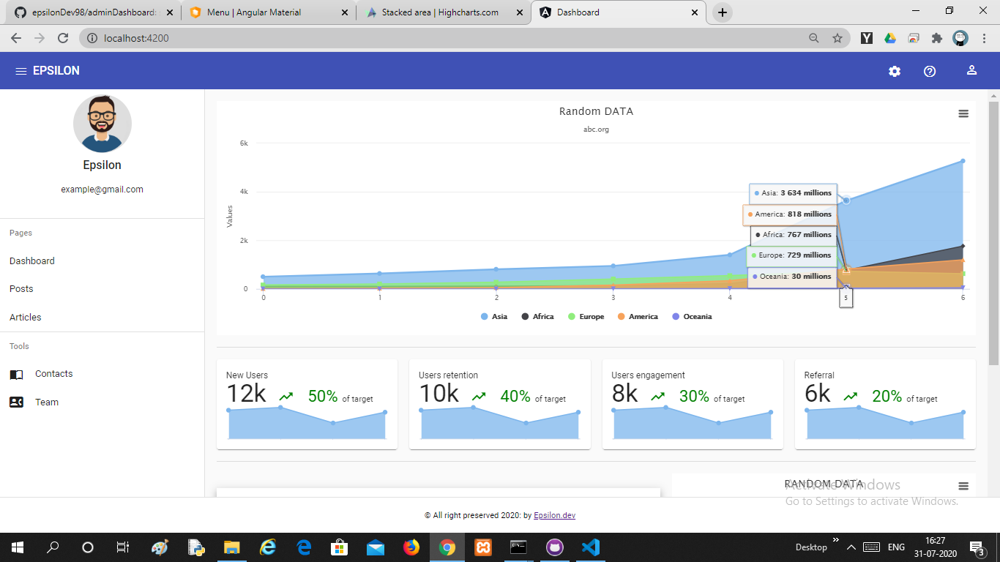

# adminDashboard
 simple admin panel template using Angular9 and Material
 
 ### how to run
 ensure that you have installed angular cli if not!
 use this command
 npm install -g @angular/cli
``` 
git clone 
cd adminDashboard
npm install
ng serve -o (it will automatically open localhost:4200)
```

#### TODO
- [x] Template ready
- [ ] more features
- [ ] upload to github

#### Initial Screenshot

